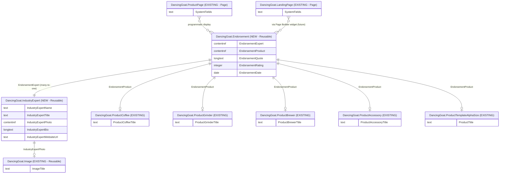

# Content Model Documentation — Industry Expert & Endorsement

## 1. Project Recap and Summary

### Project Description

Dancing Goat is a high-end coffee and coffee accessories online retailer running on Xperience by Kentico (XbK). This document describes an **enhancement** to the existing content model by introducing two new **reusable content types**:

1. **Industry Expert** (`DancingGoat.IndustryExpert`) — a recognised person in the coffee enthusiast community whose opinion on coffee-related products and services carries weight with the target audience.
2. **Endorsement** (`DancingGoat.Endorsement`) — a product endorsement given by a specific Industry Expert, containing a quote, optional rating, and a reference to the product being endorsed.

### Chosen Approach: Atomic

The **atomic (reusable content) approach** was selected because:

- Both content types need to be reused across **multiple channels** — website and email — without duplication.
- Products already exist as reusable content items in the Content Hub; Endorsements naturally link to them.
- Endorsements will be surfaced programmatically on existing product pages, through future Page Builder widgets on landing pages, and in Email Builder marketing campaigns.

### Key Requirements and Decisions

| Decision Area        | Choice                              | Rationale                                                         |
| -------------------- | ----------------------------------- | ----------------------------------------------------------------- |
| Content type usage   | Reusable content                    | Cross-channel reuse (website + email)                             |
| Image handling       | Uses existing `DancingGoat.Image`   | Consistent with established project conventions                   |
| Product linking      | All 5 product content types allowed | Any product category can be endorsed                              |
| Page Builder widgets | Planned, not in scope               | Out of scope for this phase; future dev task                      |
| Field naming         | Prefixed with content type name     | Follows XbK best-practice convention to avoid DB column conflicts |
| Namespace            | `DancingGoat`                       | Consistent with all existing content types in this project        |

### Overview of Content Model Structure

```
Content Hub (Reusable Content)
├── DancingGoat.IndustryExpert  [NEW]
└── DancingGoat.Endorsement     [NEW]
      ├── → DancingGoat.IndustryExpert
      └── → DancingGoat.Product* (any of 5 types)

Website Channel (existing pages)
├── DancingGoat.ProductPage  [EXISTING] — programmatically displays endorsements
└── DancingGoat.LandingPage  [EXISTING] — displays endorsements via future widgets

Email Channel
└── Endorsement items referenced in Email Builder marketing emails
```

---

## 2. Mermaid ERD Diagram

The following diagram shows the new content types (highlighted), their fields, and how they connect to existing content types.



---

## 3. Content Type Field Reference Tables

### 3.1 DancingGoat.IndustryExpert

**Purpose:** Stores structured data about a coffee industry expert — a named person whose endorsement of products carries credibility with the Dancing Goat audience. Items of this type live in the Content Hub and can be referenced from Endorsements, displayed on website pages, and included in email content.

**Usage scenarios:**

- Referenced by Endorsement items to attribute a quote and rating to a named expert.
- Potentially displayed on a dedicated "Meet Our Experts" page (future).
- Included in email campaigns featuring expert recommendations.

| Field Name                 | Data Type              | Form Component        | Required | Validation / Constraints                       | Explanation                                                                                                                                                             |
| -------------------------- | ---------------------- | --------------------- | -------- | ---------------------------------------------- | ----------------------------------------------------------------------------------------------------------------------------------------------------------------------- |
| `IndustryExpertName`       | Text                   | Text input            | **Yes**  | Max 200 characters                             | The expert's full display name shown on the website and in emails.                                                                                                      |
| `IndustryExpertTitle`      | Text                   | Text input            | No       | Max 200 characters                             | Professional title or role descriptor, e.g. "Master Barista", "Coffee Critic", "Head Roaster at XYZ Roastery". Displayed beneath the name for credibility.              |
| `IndustryExpertPhoto`      | Content item reference | Content item selector | No       | Allowed type: `DancingGoat.Image` · Max 1 item | A headshot or professional photo of the expert. Uses the existing `DancingGoat.Image` content type already established in the project.                                  |
| `IndustryExpertBio`        | Long text (rich text)  | Rich text editor      | No       | —                                              | A short biography suitable for display on the website. Describes the expert's background, credentials, and area of expertise. Keep concise — 2–4 sentences recommended. |
| `IndustryExpertWebsiteUrl` | Text                   | Text input            | No       | Max 500 characters                             | URL to the expert's personal website, blog, or primary social media profile. Used to link the expert's name in displayed endorsements.                                  |

---

### 3.2 DancingGoat.Endorsement

**Purpose:** Captures a product endorsement — a quote and optional rating — from a specific Industry Expert for a specific Dancing Goat product. Endorsement items are reusable and can be displayed programmatically on product pages, inserted into landing pages via Page Builder widgets, and included in marketing emails via the Email Builder.

**Usage scenarios:**

- Displayed programmatically on non-Page Builder product landing pages (e.g. ProductPage) by querying endorsements that reference the current product.
- Placed on Page Builder landing pages using future Endorsement widgets.
- Included in marketing emails promoting specific products.

| Field Name           | Data Type              | Form Component        | Required | Validation / Constraints                                                                                                       | Explanation                                                                                                                                                 |
| -------------------- | ---------------------- | --------------------- | -------- | ------------------------------------------------------------------------------------------------------------------------------ | ----------------------------------------------------------------------------------------------------------------------------------------------------------- |
| `EndorsementExpert`  | Content item reference | Content item selector | **Yes**  | Allowed type: `DancingGoat.IndustryExpert` · Max 1 item                                                                        | The industry expert giving this endorsement. Exactly one expert must be selected.                                                                           |
| `EndorsementProduct` | Content item reference | Content item selector | **Yes**  | Allowed types: `ProductCoffee`, `ProductGrinder`, `ProductBrewer`, `ProductAccessory`, `ProductTemplateAlphaSize` · Max 1 item | The product being endorsed. Any of the 5 existing Dancing Goat product content types is valid. Exactly one product must be selected.                        |
| `EndorsementQuote`   | Long text              | Text area             | **Yes**  | Max 1000 characters                                                                                                            | The expert's endorsement statement. This is the primary content displayed in widgets and emails. Keep concise so it renders cleanly in constrained layouts. |
| `EndorsementRating`  | Integer                | Number input          | No       | Min: 1 · Max: 5                                                                                                                | An optional star rating (1–5) given by the expert. When present, can be rendered as a star graphic in templates.                                            |
| `EndorsementDate`    | Date                   | Date input            | No       | —                                                                                                                              | The date the endorsement was originally given or published. Helps editors manage freshness of endorsements and can be displayed for transparency.           |

---

## 4. Content Relationships (Detailed Explanation)

### 4.1 Endorsement → Industry Expert (Many-to-One)

- **Connected types:** `DancingGoat.Endorsement` → `DancingGoat.IndustryExpert`
- **Field:** `EndorsementExpert`
- **Cardinality:** Many-to-one — a single expert can give many endorsements across different products; each endorsement references exactly one expert.
- **Rationale:** Separating the expert identity from the endorsement allows the same expert's profile (name, photo, bio, title) to be maintained in one place and reused across multiple endorsements without duplication.
- **Use case:** When an endorsement is displayed on a product page, the system loads the linked `IndustryExpert` item to render the expert's name, photo, and title alongside the quote.

### 4.2 Endorsement → Product (Many-to-One, Polymorphic)

- **Connected types:** `DancingGoat.Endorsement` → any of 5 product content types
- **Field:** `EndorsementProduct`
- **Cardinality:** Many-to-one — a single product can have many endorsements; each endorsement references exactly one product.
- **Rationale:** Products already exist as reusable content items in the Content Hub. Linking endorsements directly to existing product items means no product data is duplicated, and endorsements can be automatically associated with and queried from the correct product display page.
- **Use case:** On a `ProductPage`, the developer queries all `Endorsement` items whose `EndorsementProduct` matches the product displayed on the current page, then renders them below the product description.
- **Note on polymorphism:** A single `EndorsementProduct` field accepts any of the 5 product content types. This allows all product categories to be endorsed without creating separate endorsement types per product category.

### 4.3 Industry Expert → Image (Many-to-One)

- **Connected types:** `DancingGoat.IndustryExpert` → `DancingGoat.Image`
- **Field:** `IndustryExpertPhoto`
- **Cardinality:** Many-to-one — one image asset can be reused across multiple expert profiles (e.g. stock photos), though typically each expert has their own photo.
- **Rationale:** Uses the existing `DancingGoat.Image` content type already established in the project for consistent image management, instead of embedding raw media fields.

### 4.4 ProductPage → Endorsement (Runtime, One-to-Many)

- **Connected types:** `DancingGoat.ProductPage` (existing page) ↔ `DancingGoat.Endorsement`
- **Nature:** Not a direct field link. Endorsements are fetched at runtime by querying the Content Hub for `Endorsement` items whose `EndorsementProduct` references the product associated with the current page.
- **Rationale:** Product pages are not modified by this content model change. The developer implements a query in the page controller or view component to retrieve relevant endorsements dynamically.

### 4.5 LandingPage → Endorsement (Page Builder Widget, One-to-Many)

- **Connected types:** `DancingGoat.LandingPage` (existing page) ↔ `DancingGoat.Endorsement`
- **Nature:** Future Page Builder widget(s) will allow editors to select specific `Endorsement` items to display on a landing page. This relationship is editorial and configured per-page by the content team.
- **Rationale:** Landing pages with Page Builder support allow editors to curate which endorsements appear in marketing contexts, such as campaign pages promoting a product range.

---

## 5. Reusable Field Schemas

No new reusable field schemas are introduced in this content model enhancement. Both new content types (`IndustryExpert` and `Endorsement`) use direct fields only.

**Existing project schemas** (not modified by this change) continue to apply to the existing content types they are already assigned to.

**Future consideration:** If additional "person" content types are introduced later (e.g. Blog Author, Brand Ambassador), consider extracting shared fields (`Name`, `Photo`, `Bio`, `WebsiteUrl`) into a `PersonProfile` reusable field schema that `IndustryExpert` and other person types can share.

---

## 6. Taxonomies

No taxonomies are introduced as part of this content model enhancement.

**Future consideration:** A **Coffee Expertise Area** taxonomy could be added to `IndustryExpert` (e.g. Brewing, Roasting, Tasting, Barista Skills) to allow filtering experts by specialty. Similarly, an **Endorsement Type** taxonomy (e.g. Written Quote, Video, Event Appearance) could categorise endorsements for editorial filtering.

---

## 7. Website Page Structure (Page Tree)

No changes to the existing page tree are required. The two new content types are **reusable content** that lives in the **Content Hub**, not the website content tree.

The relevant existing pages that will surface the new content are:

```
Website Content Tree (unchanged)
└── /products/
    └── [product-slug]/          → DancingGoat.ProductPage (existing)
                                   Endorsements displayed programmatically below product details

└── /[landing-page-slug]/        → DancingGoat.LandingPage (existing)
                                   Endorsements displayed via future Page Builder widget

Content Hub (additions)
├── Industry Experts/
│   ├── Jane Smith - Master Barista
│   ├── Carlos Ruiz - Coffee Critic
│   └── ...
└── Endorsements/
    ├── Jane Smith endorses Ethiopia Arabica
    ├── Carlos Ruiz endorses Precision Grinder Pro
    └── ...
```

---

## 8. Templates (Detailed Description)

### 8.1 Landing Page Template (Existing)

- **Name:** Landing Page Template
- **Identifier:** `DancingGoat.LandingPageTemplate`
- **Status:** Existing — not modified by this content model
- **Pages using it:** All `DancingGoat.LandingPage` instances
- **Relevance to this change:** Future Endorsement widget(s) will be made available for editors to drop into the editable areas of this template.
- **Editable areas:** As defined in the existing template implementation. No changes required for the content model phase.

No new templates are introduced as part of this content model enhancement.

---

## 9. Sections (Detailed Description with Layout Simulation)

No new Page Builder sections are introduced as part of this content model enhancement using the existing project's section definitions.

**Future consideration:** An "Expert Endorsements" section could be introduced to provide a visually consistent layout for displaying multiple endorsements in a grid or carousel format on landing pages.

---

## 10. Widgets (Detailed Description)

No Page Builder widgets are defined as part of this content model phase, as per the project scope.

**Planned future widget — Endorsement Display Widget:**

| Property        | Detail                                                                                                   |
| --------------- | -------------------------------------------------------------------------------------------------------- |
| Widget name     | Endorsement Display Widget                                                                               |
| Type            | Content Hub selection                                                                                    |
| Purpose         | Allow editors to select and display one or more `Endorsement` items on a Page Builder page               |
| Content source  | Content Hub (`DancingGoat.Endorsement`)                                                                  |
| Configuration   | Editor selects endorsement item(s); widget renders expert name, photo, title, quote, and optional rating |
| Display options | Single endorsement card; multi-endorsement carousel (TBD by UI design)                                   |
| Use on          | `DancingGoat.LandingPage` pages via Landing Page Template                                                |

---

## 11. Personalization Approaches

No personalization is defined for this content model enhancement.

**Future consideration:** Endorsements could be personalized based on visitor persona or interests. For example:

- Show a brewing expert's endorsement to visitors who have browsed brewer products.
- Show a barista's endorsement on pages visited by cafe-owner personas.

This would leverage Xperience by Kentico's built-in personalization features (contact groups, persona taxonomies) without requiring changes to the content model itself.

---

## 12. Customizations and Special Considerations

### Developer Implementation Notes

**Programmatic display on ProductPage:**

The developer must implement a query in the `DancingGoatProductDetailController` (or a related view component) to retrieve endorsements for the product displayed on the current page. The query pattern:

1. Get the content item GUID of the current product (from `ProductPage` data).
2. Query `ContentItemQueryBuilder` for `DancingGoat.Endorsement` items where `EndorsementProduct` references that GUID.
3. For each result, also retrieve the linked `DancingGoat.IndustryExpert` (via `EndorsementExpert`) to render expert details.
4. Render the endorsements in the product detail view.

**Email Builder integration:**

`Endorsement` items will be available to email template designers in the Email Builder as reusable content items. No custom code is required for this — it is native XbK functionality for reusable content types.

**Generated code files:**

After creating both content types in the Xperience administration, regenerate code files (via **System > Generate code files**) to produce the strongly-typed C# model classes:

- `IndustryExpert.generated.cs`
- `Endorsement.generated.cs`

Place these in appropriate subdirectories, following the existing project convention (e.g. `src/DancingGoat/Models/Reusable/IndustryExpert/` and `src/DancingGoat/Models/Reusable/Endorsement/`).

### Content Governance

- **IndustryExpert items** should be created and maintained by a designated content owner (e.g. Marketing team) to ensure expert profiles are accurate and up to date.
- **Endorsement items** should be reviewed before publishing to verify quote accuracy and to confirm the referenced product is still active.
- Consider setting up a simple **workflow** for Endorsement items requiring approval before publishing, given their public-facing nature.

---

## 13. Implementation Guidance

### Phased Implementation

**Phase 1 — Content Model (this phase):** Create the two content types in XbK admin, regenerate code files.

**Phase 2 — ProductPage integration:** Implement programmatic endorsement display on product detail pages (controller query + partial view).

**Phase 3 — Email Builder:** Add endorsement content to email templates using Content Hub selection in Email Builder.

**Phase 4 — Page Builder Widget:** Develop the Endorsement Display Widget for use on Landing Pages.

### Step-by-Step Setup

1. **Create `DancingGoat.IndustryExpert` content type** in the XbK Xperience admin:
   - Navigate to **Content types** → **New content type**
   - Display name: `Industry Expert` · Namespace: `DancingGoat` · Name: `IndustryExpert`
   - Use for: **Reusable content**
   - Add all 5 fields as defined in Section 3.1

2. **Create `DancingGoat.Endorsement` content type** in the XbK admin:
   - Display name: `Endorsement` · Namespace: `DancingGoat` · Name: `Endorsement`
   - Use for: **Reusable content**
   - Add all 5 fields as defined in Section 3.2
   - For `EndorsementExpert`: restrict allowed content type to `DancingGoat.IndustryExpert`
   - For `EndorsementProduct`: allow all 5 product content types listed in Section 3.2

3. **Regenerate code files** via **System > Generate code files** for both new content types.

4. **Create sample content** in the Content Hub — at least 1–2 Industry Expert items and 1–2 Endorsement items for testing.

5. **Implement the ProductPage query** in the controller/view component to retrieve and display endorsements.

### Best Practices

- Always prefix field names with the content type name (e.g. `IndustryExpertName`, `EndorsementQuote`) to prevent database column name conflicts when using reusable field schemas in the future.
- Keep the `EndorsementQuote` concise (under 300 characters recommended) even though the field allows up to 1000 — short quotes render better in widgets and email columns.
- Validate that the `EndorsementDate` is not in the future before publishing; consider adding a workflow step checking this.

### Common Pitfalls to Avoid

- **Do not** modify existing product content types to add an endorsements field — the relationship is managed from the Endorsement side (many-to-one to product), not from the product side. This keeps product types clean and avoids circular dependencies.
- **Do not** duplicate expert information in the Endorsement item (e.g. copy-pasting the expert's name into a text field on Endorsement). Always reference the `IndustryExpert` item so updates propagate everywhere automatically.

---

## 14. Validation Results

| Check                                                         | Result                      |
| ------------------------------------------------------------- | --------------------------- |
| Requirements gathered and approach selected                   | ✅ Passed                   |
| Content types defined with correct naming conventions         | ✅ Passed                   |
| Field names prefixed with content type name                   | ✅ Passed                   |
| Namespace `DancingGoat` used consistently                     | ✅ Passed                   |
| Reusable content usage set correctly for cross-channel types  | ✅ Passed                   |
| `DancingGoat.Image` used for photo fields                     | ✅ Passed                   |
| All 5 product content types permitted on `EndorsementProduct` | ✅ Passed                   |
| Relationships defined with correct cardinality                | ✅ Passed (9 relationships) |
| Page Builder phase acknowledged (widgets out of scope)        | ✅ Passed                   |
| Final model validation                                        | ✅ Passed                   |

---

## 15. Summary Statistics

| Metric                            | Value                                                                                                                                         |
| --------------------------------- | --------------------------------------------------------------------------------------------------------------------------------------------- |
| New content types                 | 2 (`IndustryExpert`, `Endorsement`)                                                                                                           |
| New fields total                  | 10 (5 per content type)                                                                                                                       |
| Relationships defined             | 9                                                                                                                                             |
| Existing content types referenced | 7 (`Image`, `ProductCoffee`, `ProductGrinder`, `ProductBrewer`, `ProductAccessory`, `ProductTemplateAlphaSize`, `LandingPage`, `ProductPage`) |
| Page Builder templates referenced | 1 (existing `LandingPageTemplate`)                                                                                                            |
| Page Builder widgets defined      | 0 (out of scope; planned for Phase 4)                                                                                                         |
| Taxonomies introduced             | 0                                                                                                                                             |
| Reusable field schemas introduced | 0                                                                                                                                             |
| Channels supported                | Website, Email                                                                                                                                |
| Content reuse level               | Extensive                                                                                                                                     |
