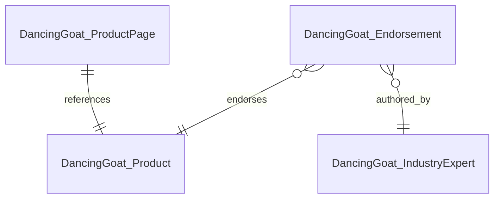

## 1. Project Recap and Summary

Dancing Goat needs two new reusable content types: Industry Expert and Endorsement. Endorsements must show on product pages, landing pages via Page Builder, and marketing emails via Email Builder. Approach: Page Builder, reuse-heavy. Existing product content remains; this model adds expert and endorsement content plus links to products.

## 2. Mermaid ERD Diagram (MANDATORY)

## 3. Content Type Field Reference Tables (MANDATORY)

### DancingGoat.ProductPage

Purpose: page that renders a single reusable product. Uses existing page routing.

| Field Name | Data Type    | Form Component        | Required | Validation/Constraints                    | Visibility Conditions | Explanation                           | Text Below Input | Tooltip | Related To          |
| ---------- | ------------ | --------------------- | -------- | ----------------------------------------- | --------------------- | ------------------------------------- | ---------------- | ------- | ------------------- |
| product    | content_item | Content item selector | Yes      | maxItems: 1; allowed: DancingGoat.Product | n/a                   | Links page to a reusable product item | n/a              | n/a     | DancingGoat.Product |

Usage scenarios: product detail pages, product landing page links.

### DancingGoat.Product

Purpose: existing reusable product item used across pages and marketing. This model treats it as pre-existing.

| Field Name        | Data Type | Form Component | Required | Validation/Constraints | Visibility Conditions | Explanation                                     | Text Below Input | Tooltip | Related To |
| ----------------- | --------- | -------------- | -------- | ---------------------- | --------------------- | ----------------------------------------------- | ---------------- | ------- | ---------- |
| (existing fields) | n/a       | n/a            | n/a      | n/a                    | n/a                   | Product schema already defined in current model | n/a              | n/a     | n/a        |

Usage scenarios: product pages, endorsements, promotions, emails.

### DancingGoat.IndustryExpert

Purpose: store expert identity and credibility data.

| Field Name   | Data Type | Form Component   | Required | Validation/Constraints          | Visibility Conditions | Explanation                | Text Below Input | Tooltip | Related To |
| ------------ | --------- | ---------------- | -------- | ------------------------------- | --------------------- | -------------------------- | ---------------- | ------- | ---------- |
| fullName     | text      | Text input       | Yes      | maxLength: 200                  | n/a                   | Expert full name           | n/a              | n/a     | n/a        |
| title        | text      | Text input       | No       | maxLength: 200                  | n/a                   | Role or professional title | n/a              | n/a     | n/a        |
| organization | text      | Text input       | No       | maxLength: 200                  | n/a                   | Affiliation or company     | n/a              | n/a     | n/a        |
| bio          | rich_text | Rich text editor | No       | n/a                             | n/a                   | Short bio for credibility  | n/a              | n/a     | n/a        |
| photo        | asset     | Asset selector   | No       | maxAssets: 1; jpg/jpeg/png/webp | n/a                   | Headshot or profile photo  | n/a              | n/a     | n/a        |
| websiteUrl   | url       | URL input        | No       | n/a                             | n/a                   | Expert personal site       | n/a              | n/a     | n/a        |

Usage scenarios: expert profile snippets, endorsement attribution blocks, email signatures.

### DancingGoat.Endorsement

Purpose: a product endorsement with quote and supporting details.

| Field Name   | Data Type    | Form Component        | Required | Validation/Constraints                           | Visibility Conditions | Explanation                      | Text Below Input | Tooltip | Related To                 |
| ------------ | ------------ | --------------------- | -------- | ------------------------------------------------ | --------------------- | -------------------------------- | ---------------- | ------- | -------------------------- |
| title        | text         | Text input            | Yes      | maxLength: 200                                   | n/a                   | Short internal-facing title      | n/a              | n/a     | n/a                        |
| expert       | content_item | Content item selector | Yes      | maxItems: 1; allowed: DancingGoat.IndustryExpert | n/a                   | Links endorsement to expert      | n/a              | n/a     | DancingGoat.IndustryExpert |
| product      | content_item | Content item selector | Yes      | maxItems: 1; allowed: DancingGoat.Product        | n/a                   | Links endorsement to product     | n/a              | n/a     | DancingGoat.Product        |
| summaryQuote | text         | Text input            | Yes      | maxLength: 280                                   | n/a                   | Short quote for cards and emails | n/a              | n/a     | n/a                        |
| details      | rich_text    | Rich text editor      | No       | n/a                                              | n/a                   | Longer endorsement text          | n/a              | n/a     | n/a                        |
| rating       | number       | Number input          | No       | min: 1; max: 5; precision: 1                     | n/a                   | Optional rating                  | n/a              | n/a     | n/a                        |
| endorsedOn   | date_time    | Date time picker      | No       | n/a                                              | n/a                   | Date of endorsement              | n/a              | n/a     | n/a                        |
| image        | asset        | Asset selector        | No       | maxAssets: 1; jpg/jpeg/png/webp                  | n/a                   | Optional visual for cards        | n/a              | n/a     | n/a                        |
| featured     | boolean      | Checkbox              | No       | n/a                                              | n/a                   | Flag for curated lists           | n/a              | n/a     | n/a                        |

Usage scenarios: product page highlight, landing page module, email promo block.

## 4. Content Relationships (Detailed Explanation)

- Endorsement -> Industry Expert (many_to_one): many endorsements can reference the same expert; supports attribution and reuse.
- Endorsement -> Product (many_to_one): multiple endorsements can be attached to one product; supports curated proof.
- Product Page -> Product (one_to_one): page renders one reusable product item.

Overall structure: reusable product content sits in Content Hub; pages and endorsements reference it, enabling cross-channel reuse.

## 5. Reusable Field Schemas

- Product reusable field schema (existing): used by current product content types (coffee, grinders, clothing). Fields remain unchanged and are not repeated here. New content types do not introduce new schemas.

## 6. Taxonomies

No new taxonomies added for Industry Expert or Endorsement. Existing taxonomies (if any) stay unchanged.

## 7. Website Page Structure (Page Tree)

- Product pages continue under the product catalog branch and use Product Page type.
- Landing pages use Page Builder and can surface endorsements via future widgets.
- Endorsements and experts are reusable content and do not appear directly in the page tree.

## 8. Templates (Detailed Description)

### Landing Page

Purpose: base Page Builder template for marketing and product campaign pages.

Editable areas: standard Page Builder area.

Allowed widgets/sections: none defined in this phase (to be added later).

## 9. Sections (Detailed Description with Layout Simulation)

No custom sections defined in this phase.

Layout simulation: n/a

## 10. Widgets (Detailed Description)

No widgets defined in this phase. Endorsement display widgets for Page Builder and Email Builder are planned but out of scope.

## 11. Personalization Approaches

No personalization rules, personas, or contact groups defined for endorsements in this phase. Can be layered later using existing personalization features.

## 12. Customizations and Special Considerations

- Product content type is represented as an existing item; align allowed content types to actual product types in implementation.
- Endorsement widgets for Page Builder and Email Builder must be added in a later phase.
- Governance: endorsements should follow an approval workflow due to marketing impact.

## 13. Implementation Guidance

1. Create Industry Expert and Endorsement content types in Content Hub.
2. Map Endorsement.product allowed types to existing product content types.
3. Update product page queries to pull endorsements by product.
4. Build Page Builder and Email Builder widgets for endorsements.
5. Add editorial guidance and workflow for endorsement approval.

## 14. Validation Results

All required phases validated successfully: content types, relationships, and Page Builder template.

## 15. Summary Statistics

- Content types: 4 (2 new, 2 existing placeholders)
- Relationships: 3
- Templates: 1
- Sections: 0
- Widgets: 0
