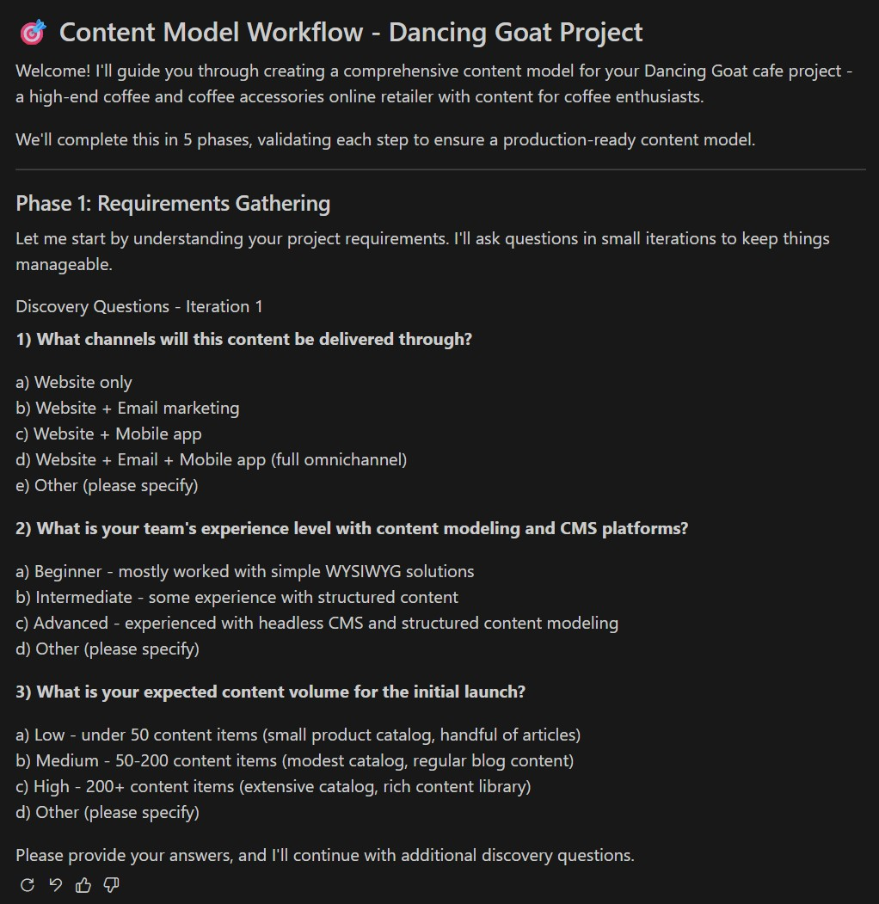
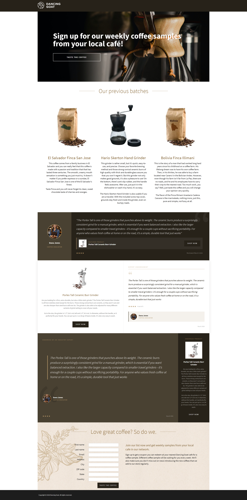

# Xperience by Kentico: KentiCopilot lab

## Initial KentiCopilot Setup

1. [Install Docs MCP server](https://docs.kentico.com/documentation/developers-and-admins/installation/mcp-server#install-the-mcp-server)
1. Start the Docs MCP server (if not already started)
1. [Install Content modeling MCP server](https://docs.kentico.com/guides/architecture/content-modeling/content-modeling-mcp#install-the-mcp-server)

   💡 ${\color{lightgreen}Agent \space prompt}$

   ```markdown
   Install Kentico's content modeling MCP server into my project, using VS Code configuration syntax
   ```

1. [Enable the management API](https://docs.kentico.com/documentation/developers-and-admins/development/content-types/management-api#enable-the-management-api)

   💡 ${\color{lightgreen}Agent \space prompt}$

   ```markdown
   Enable Xperience's content management API in the DancingGoat project. Use the default configuration. This is a prerelease package so find the correct package version that matches this project's Xperience version.
   ```

1. [Configure the management API MCP server](https://docs.kentico.com/documentation/developers-and-admins/development/content-types/management-api#management-api-mcp-server)

   💡 ${\color{lightgreen}Agent \space prompt}$

   ```markdown
   Configure Xperience's management API MCP server for this project. Use the VS Code configuration syntax.
   ```

## AI assisted Content modeling

You can use this MCP server to build a brand new content model from scratch, or extend an existing one you already have in your Xperience by Kentico project.

If you provide a simple explanation about your project and business the MCP server and agent will try to gather enough context to define requirements and a content modeling strategy.



Alternatively, you can provide the context yourself if you have a specific content marketing idea or goal in mind. If you provide enough context, the requirements gathering process is skipped.

We will provide context explaining we will enhance an existing content model. The workflow will define a model strategy based entirely on this context.

1. Start the content modeling MCP server
1. Run the [Start content modeling](https://docs.kentico.com/guides/architecture/content-modeling/content-modeling-mcp#getting-started) workflow via prompt

   💡 ${\color{lightgreen}Agent \space prompt}$

   ```markdown
   /mcp.kentico-cm-mcp.start_content_modeling

   Dancing Goat cafe, high-end coffee and coffee accessories online retailer featuring articles for coffee enthusiasts.

   We need to enhance our existing content model.

   We want to add 2 new content models:

   1.  An "Industry Expert" who is a person recognized in coffee enthusiast communities with a valued opinion of coffee-related products and services.
   2.  An "Endorsement" of a product (e.g. coffee, grinder) from a specific "Industry Expert" with some details about the product being endorsed.

   We want to use this content across our website and email channels.
   These endorsements will be programmatically displayed on existing non-Page Builder product landing pages and will added to landing pages using the Page Builder widgets.
   We also want to display them in our marketing emails promoting products using the Email Builder. However, we don't need to define those widgets in this process.

   Notes:

   - Any linked images should use the existing DancingGoat.Image content type.
   - Products are reusable content linked to the web pages that display them. They already exist in the content model. The following are the available content types for products and they are all valid for endorsement:
     - DancingGoat.ProductCoffee
     - DancingGoat.ProductGrinder
     - DancingGoat.ProductBrewer
     - DancingGoat.ProductAccessory
     - DancingGoat.ProductTemplateAlphaSize
   - Product page types are named DancingGoat.ProductPage
   - Landing page types are named DancingGoat.LandingPage
   - The Landing page type has a template named DancingGoat.LandingPageSingleColumn
   - Always use the kentico-docs-mcp MCP server to find the best practices for content type naming conventions.
   ```

1. Allow the `content_modeling_validate_requirements` tool to run
1. Allow the `content_modeling_validate_content_types` tool to run. The agent might iterate on this process until the validation passes.
1. Allow the `content_modeling_validate_relationships` tool to run.
1. Allow the `content_modeling_validate_pagebuilder` tool to run.
1. Review the generated `content_model.json` and `CONTENT_MODEL_DOCUMENTATION.md`.
1. Move the files to `.agent-resources/endorsements` folder for later use.

## Content type creation via MCP server

1. Request the agent create content types based on the content modeling artifacts

   **Note**: Ensure the MCP server is running and the tools are enabled for the agent session

   💡 ${\color{lightgreen}Agent \space prompt}$

   ```markdown
   Use the provided content model plan and the xperience-management-api MCP server to create new content types.

   Notes:

   - Required `contentitemreference` should not set `required: true` at the field level, but instead have a minimum number of linked items of 1.
   - Do not apply validation rules to any of the fields.
   ```

1. Apply or skip any suggested content type refinements
1. Request the agent generate content type C# classes using the DancingGoat `README.md`.

   💡 ${\color{lightgreen}Agent \space prompt}$

   ```markdown
   Regenerate the reusable content type classes
   ```

## Agent-driven widget code generation

1. Clone the [KentiCopilot repository](https://github.com/Kentico/xperience-by-kentico-kenticopilot) locally
1. Review the instructions for the [widget creation tool](https://github.com/Kentico/xperience-by-kentico-kenticopilot/tree/main/src/widget-creation)
1. Copy that tool's [gh-copilot/.github folder](https://github.com/Kentico/xperience-by-kentico-kenticopilot/tree/v0.1.0/src/widget-creation/gh-copilot/.github) into the current repository folder at the root
   - **Note**: for editors other than VS Code with GitHub Copilot, use the appropriate folders in the repository
   - **Note**: this will be simpler in the future with AI plugins in VS Code (already available in Claude Code and Cursor)

   ```powershell
   cp -R .\.github\ ..\..\..\..\xperience-by-kentico-labs-kenticopilot\
   ```

   or

   💡 ${\color{lightgreen}Agent \space prompt}$

   ```markdown
   add this folder and its files to this repository so i can use the KentiCopilot widget generation tools here
   https://github.com/Kentico/xperience-by-kentico-kenticopilot/tree/main/src/widget-creation/gh-copilot/.github
   ```

   In the near future you will be able to use plugins and a Kentico plugin marketplace to easily install the tools

1. Request the agent to perform research for the widget you want to generate

   💡 ${\color{lightgreen}Agent \space prompt}$

   ```markdown
   /widget-create-research .agent-resources/endorsements
   ```

1. Request the agent write the widget code using the newly generated instructions

   💡 ${\color{lightgreen}Agent \space prompt}$

   ```markdown
   /widget-create-implementation .agent-resources/endorsements/WIDGET_CREATE.instructions.md
   ```

## (optional) Generate widget templates with AI

1. Prompt the agent to generate multiple variations of widget templates for the endorsement content type with the right context:
   - `Endorsement.generated.cs`
   - `Site.css`
   - `_ProductCardWidget.cshtml`
   - `_DancingGoat_LandingPage_TestimonialWidget.cshtml`

   💡 ${\color{lightgreen}Agent \space prompt}$

   ```markdown
   Using this project's css rules and some example components like the product card and testimonial, generate 3 variations of a design.html file that represents a well designed component for the Endorsement data model.

   The endorsement is supposed to feature an industry expert who is promoted a specific Dancing Goat product.

   It's like a testimonial but used to drive purchases of specific products based on the persona-appeal of the endorser.

   Only use HTML, CSS, or JavaScript - no C# or Razor.
   Store this artifact in `./agent-resources/endorsements`
   ```

## Coffee Samples Page


